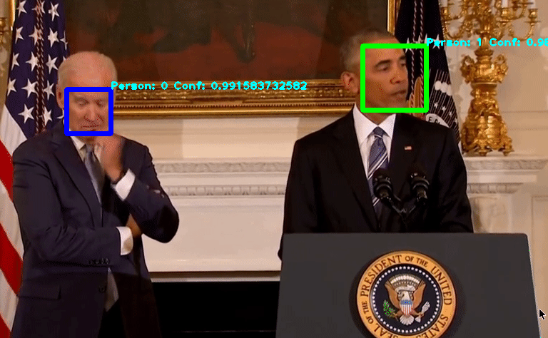

Remote Face Tracking & Classification Application
=================================================

This is a face tracking & classification application for video streaming based on `dlib <http://dlib.net/>`_ and `Openface <http://cmusatyalab.github.io/openface/>`_ models. In general, it has the following features:

* Remote computation. The computational tasks for tracking and classification could be done on remote server sides. The client can send frames and receives results from the server through HTTP protocol.
* Support both stateful and stateless machine learning algorithms for facial classification. 

System Requirements
-------------------------
To setup the application, install the following types of requirements:

* python packages in `requirements.txt <requirements.txt>`_
* Openface
* Torch/Torch dependencies listed `here <http://cmusatyalab.github.io/openface/setup/>`_

.. code-block:: bash

    $sudo pip install -r requirements.txt
    $git clone https://github.com/cmusatyalab/openface.git && cd openface && sudo python setup.py install && cd ..
    $git clone https://github.com/torch/distro.git ~/torch --recursive
    $cd ~/torch; bash install-deps;
    $./install.sh
    $luarocks install dpnn
    $luarocks install nn
    $luarocks install optim
    $luarocks install csvigo
    $luarocks install cutorch # if using CUDA

Run the Application
-------------------------
In order to label your video, first put the video into ``RemoteFaceClassifier/video/`` and name it as ``test_video.mp4``. Then prepare a dataset for all the people appears in the video. Make sure the dataset exists in the folder ``dataset/raw``, following the structure:

.. code-block:: bash

        raw
    ├── joe
    │   ├── 1.jpg
    │   ├── 2.jpg
    │   ├── 3.jpg
    │   ├── 4.jpg
    │   ├── 5.jpg
    │   └── 6.jpg
    └── obama
        ├── 1.jpg
        ├── 2.jpg
        ├── 3.jpg
        ├── 4.jpg
        ├── 5.jpg
        └── 6.jpg

After that, we can get the pretrained face classification model by 

.. code-block:: bash

    $./load_pretrained.sh

Make sure the pretrained model has been generated at ``RemoteFaceClassifier/Server/Pretrained/``

.. code-block:: bash

    $ls ./RemoteFaceClassifier/Server/Pretrained/
    classifier.pkl*  labels.csv*  reps.csv*

If needed, modifies ``CLIENT`` and ``SERVER`` to correct IP addresses and ``CLIENT_RES_PORT`` and ``SERVER_FRAME_PORT`` to the designated ports.

.. raw:: html

    

    
.. role:: red

**Please make sure the SERVER_MODE is "Stateless" if you are using customized video.** Currently, stateful mode needs ground truth labels for each frame. The applications hardcoded the face location for the default video, asserting person0 always to be at left and person1 at right. However, this doesn't hold for customized video.

Next step is to launch the server, the server will start listening to the connected clients and return face boundaries once it receives video frames.

.. code-block:: bash

    $./run_server.sh

To launch the client and start sending frames, run

.. code-block:: bash

    $./run_client.sh

Use ``reset.sh`` to clean up these two processes and profiler measurements.

Configurable Parameters
-------------------------
Application Configuration: in the file `RemoteFaceClassifier/__init__.py <RemoteFaceClassifier/__init__.py>`_

+-------------------+------+---------------------------------------------------------------------------------------------------+
| Variables         | Type | Explanations                                                                                      |
+-------------------+------+---------------------------------------------------------------------------------------------------+
| CLIENT            | str  | IP address for client                                                                             |
+-------------------+------+---------------------------------------------------------------------------------------------------+
| CLIENT_VIDEO_PATH | str  | Path to the video                                                                                 |
+-------------------+------+---------------------------------------------------------------------------------------------------+
| CLIENT_RES_PORT   | str  | Port at client side that receives the face boundaries and classifications results from the server |
+-------------------+------+---------------------------------------------------------------------------------------------------+
| SERVER            | str  | IP address for client                                                                             |
+-------------------+------+---------------------------------------------------------------------------------------------------+
| SERVER_FRAME_PORT | str  | Port at server side that receives the incoming frame from the clients                             |
+-------------------+------+---------------------------------------------------------------------------------------------------+

Client-Side Configuration: in the file `RemoteFaceClassifier/Client/__init__.py <RemoteFaceClassifier/Client/__init__.py>`_

+--------------------+-------+----------------------------------------------------------------+
| Variables          | Type  | Explanations                                                   |
+--------------------+-------+----------------------------------------------------------------+
| VIDEO_SAMPLE_RATE  | int   | client sends one frame per VIDEO_SAMPLE_RATE frame to server   |
+--------------------+-------+----------------------------------------------------------------+
| CLASSIFY_THRESHOLD | float | If confidence < CLASSIFY_THRESHOLD, marked the face as unknown |
+--------------------+-------+----------------------------------------------------------------+
| SHOW_GUI           | bool  | Show labelled frame GUI with cv2 windows                       |
+--------------------+-------+----------------------------------------------------------------+
| WINDOW_NAME        | str   | Window name of the GUI                                         |
+--------------------+-------+----------------------------------------------------------------+
| LABEL_COLOR        | tuple | Color of prediction confidences                                |
+--------------------+-------+----------------------------------------------------------------+
| FACE_RECT_COLORS   | dict  | Boundary colors for each identities                            |
+--------------------+-------+----------------------------------------------------------------+

Server-Side Configuration: in the file `RemoteFaceClassifier/Server/__init__.py <RemoteFaceClassifier/Server/__init__.py>`_

+-----------------------------+-------+-----------------------------------------------------------------+
| Variables                   | Type  | Explanations                                                    |
+-----------------------------+-------+-----------------------------------------------------------------+
| SERVER_IMG_DIM              | int   | Input image dimension for Openface torch neural net             |
+-----------------------------+-------+-----------------------------------------------------------------+
| SERVER_CUDA                 | bool  | Use CUDA acceleration for Openface torch neural net             |
+-----------------------------+-------+-----------------------------------------------------------------+
| SERVER_MODE                 | str   | "Stateful" or "Stateless"                                       |
+-----------------------------+-------+-----------------------------------------------------------------+
| SERVER_DLIB_FACEPREDICTOR   | str   | Path to the dlib face predictor                                 |
+-----------------------------+-------+-----------------------------------------------------------------+
| SERVER_OPENFACE_MODEL       | str   | Path to the Openface torch neural net model                     |
+-----------------------------+-------+-----------------------------------------------------------------+
| SERVER_PROFILE_ENABLE       | bool  | Turn on latency measurement for each frame                      |
+-----------------------------+-------+-----------------------------------------------------------------+
| SERVER_PROFILE_DIR          | str   | Path to the pstats for latency measurement                      |
+-----------------------------+-------+-----------------------------------------------------------------+
| SERVER_FACE_SEARCH_OPTIMIZE | bool  | Reduce face search space by caching previous frame results      |
+-----------------------------+-------+-----------------------------------------------------------------+
| SERVER_FACE_SEARCH_PADDING  | float | Size of the face search space at the location of previous faces |
+-----------------------------+-------+-----------------------------------------------------------------+
| SERVER_USE_PYTORCH          | str   | Use Pytorch (not Lua subprocess) to get face representations    |
+-----------------------------+-------+-----------------------------------------------------------------+

Face Server Image
-------------------------

This application has been deployed on the Ubuntu 16.04LTS server. The image is accessible at `storage <http://hanfa.me/storage/face-xenial-server.img>`_
The username and password are ``cloudlet``.

A sample script to launch the server (port should be correctly configured according to ``CLIENT_RES_PORT`` and ``SERVER_FRAME_PORT``):

.. code::

    #!/usr/bin/env bash
    qemu-system-x86_64 --enable-kvm -cpu host -smp cores=4,threads=1 -m 8192 \
    -redir tcp:20001::20001 -redir tcp:30001::30001 \
    face-xenial-server.img

